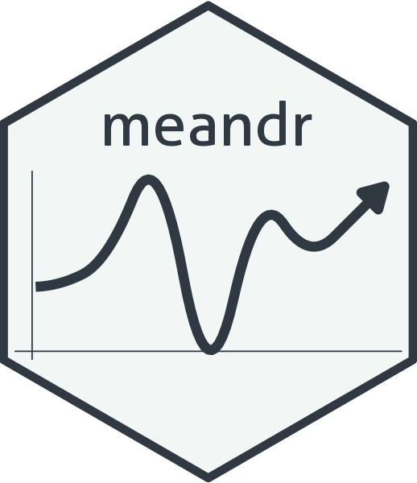

<!-- README.md is generated from README.Rmd. Please edit that file -->

```{r, include = FALSE}
knitr::opts_chunk$set(
  collapse = TRUE,
  comment = "#>",
  fig.path = "man/figures/README-",
  out.width = "100%",
  dpi = 300,
  type = 'cairo'
)

library(ggplot2)
library(dplyr)
set.seed(17)
theme_set(theme_minimal())

plot_f <- function(df) {
  ggplot(df, aes(t, f)) +
    geom_point(color = "#175C4A") +
    geom_line(color = "#175C4A")
}
```

# meandr 

<!-- badges: start -->
[](https://github.com/sccmckenzie/meandr/actions)
[](https://travis-ci.com/sccmckenzie/meandr)
<!-- badges: end -->

`meandr` allows for easy generation of coordinates that are **random, yet continuously differentiable**. This is particularly useful for simulating time-series measurements of physical phenomena that maintain a clear local trajectory.

## Installation

``` {r install, eval = FALSE}
devtools::install_github("sccmckenzie/meandr")
```

## Why meandr?

Suppose we want to simulate behavior of a "somewhat random" time-series phenomenon. That is, something that obeys well-understood physical laws (outdoor temperature is not going to drop 100 degrees in 1 second).

We could use method #1 below:

```{r}
method_1 <- data.frame(t = 1:100,
                       f = rnorm(100))
```

```{r, echo = FALSE, fig.width = 7, fig.height=2}
plot_f(method_1) +
  labs(title = "Random coordinates using rnorm()")
```

This is okay, but what if we're feeling more adventurous?

* Outdoor temperature
* Train station crowd density
* Stock price

Using above `rnorm` method, which doesn't provide any prolonged directional consistency, may not adequately emulate the *character* of these examples.

`meandr` offers a solution to this problem. Each call to `meandr()` generates a unique `tibble` of **t** and **f** coordinates. For reproducibility, a `seed` argument is provided.

```{r}
library(meandr)

df1 <- meandr(n_points = 100,
              n_nodes = 20,
              seed = 2)

df1
```

```{r echo = FALSE, fig.width=7, fig.height=3}
plot_f(df1) +
  labs(title = "meandr()", subtitle = "Example Output")
```

Observe `df1` curve trajectory never radically changes between two points. This is a key feature of `meandr`: **all curves are continuously differentiable**.
