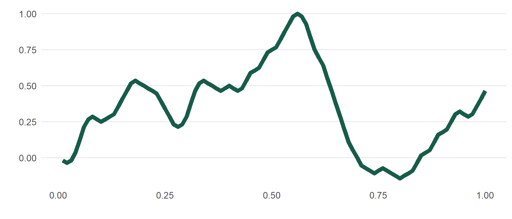

<!-- README.md is generated from README.Rmd. Please edit that file -->

# meandr 

<!-- badges: start -->

<!-- badges: end -->

`meandr` allows you to easily generate random data that is continuously
differentiable (essentially a 2nd-order spline). This is particular
useful for simulating time-series data such as weather conditions - or
any physical phenomena that maintain a clear local trajectory.

## Installation

``` r
devtools::install_github("sccmckenzie/meandr")
```

## Example

Each call to `meandr()` produces a unique tibble of coordinates.

``` r
library(meandr)

df <- meandr()

df
#> # A tibble: 100 x 2
#>         t         f
#>     <dbl>     <dbl>
#>  1 0.01    1.79e- 2
#>  2 0.02    3.57e- 2
#>  3 0.03    1.79e- 2
#>  4 0.04    1.45e-17
#>  5 0.05   -1.79e- 2
#>  6 0.06   -3.57e- 2
#>  7 0.0700 -1.79e- 2
#>  8 0.08    6.29e-17
#>  9 0.09   -1.79e- 2
#> 10 0.10   -7.14e- 2
#> # ... with 90 more rows
```

`mplot` is included as a quick `ggplot2` wrapper.

``` r
mplot(df)
```


