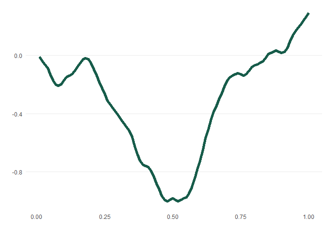

<!-- README.md is generated from README.Rmd. Please edit that file -->

# meandr

<!-- badges: start -->

<!-- badges: end -->

The goal of meandr is to easily generate random data that follows
continuous path.

## Installation

You can install meandr like so:

``` r
# devtools::install_github("sccmckenzie/meandr")
```

## Example

``` r
library(dplyr)
#> Warning: package 'dplyr' was built under R version 4.0.2
#> 
#> Attaching package: 'dplyr'
#> The following objects are masked from 'package:stats':
#> 
#>     filter, lag
#> The following objects are masked from 'package:base':
#> 
#>     intersect, setdiff, setequal, union
library(meandr)

meandr(seed = 17) %>% 
  mplot()
```


