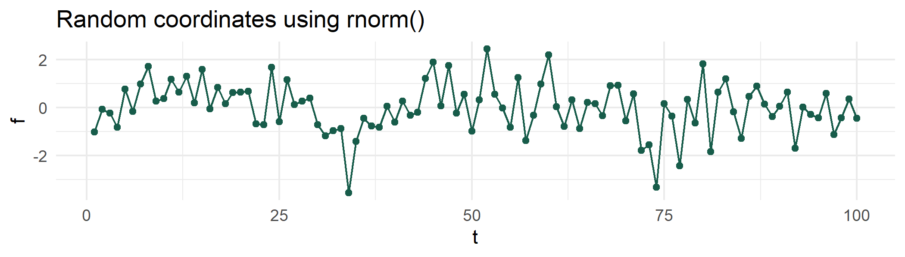
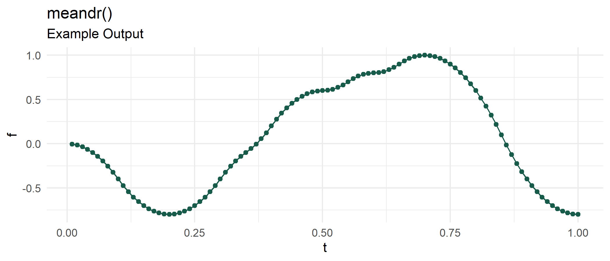

<!-- README.md is generated from README.Rmd. Please edit that file -->

# meandr 

<!-- badges: start -->

[](https://github.com/sccmckenzie/meandr/actions)
[](https://travis-ci.com/sccmckenzie/meandr)
<!-- badges: end -->

`meandr` allows for easy generation of coordinates that are **random,
yet continuously differentiable**. This is particularly useful for
simulating time-series measurements of physical phenomena that maintain
a clear local trajectory.

## Installation

``` r
devtools::install_github("sccmckenzie/meandr")
```

## Why meandr?

Suppose we want to simulate behavior of a “somewhat random” time-series
phenomenon. That is, something that obeys well-understood physical laws
(outdoor temperature is not going to drop 100 degrees in 1 second).

We could use method \#1 below:

``` r
method_1 <- data.frame(t = 1:100,
                       f = rnorm(100))
```



This is okay, but what if we’re feeling more adventurous?

  - Outdoor temperature
  - Train station crowd density
  - Stock price

Using above `rnorm` method, which doesn’t provide any prolonged
directional consistency, may not adequately emulate the *character* of
these examples.

`meandr` offers a solution to this problem. Each call to `meandr()`
generates a unique `tibble` of **t** and **f** coordinates. For
reproducibility, a `seed` argument is provided.

``` r
library(meandr)

df1 <- meandr(n_points = 100,
              n_nodes = 20,
              seed = 2)

df1
#> # A tibble: 100 x 2
#>         t        f
#>     <dbl>    <dbl>
#>  1 0.01   -0.00400
#>  2 0.02   -0.0160 
#>  3 0.03   -0.0360 
#>  4 0.04   -0.0640 
#>  5 0.05   -0.100  
#>  6 0.06   -0.144  
#>  7 0.0700 -0.196  
#>  8 0.08   -0.256  
#>  9 0.09   -0.324  
#> 10 0.10   -0.400  
#> # ... with 90 more rows
```



Observe `df1` curve trajectory never radically changes between two
points. This is a key feature of `meandr`: **all curves are continuously
differentiable**.
