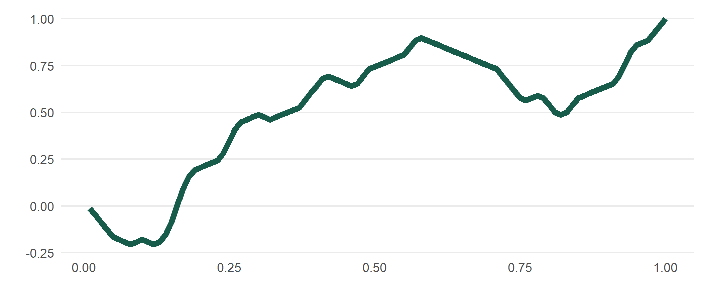

<!-- README.md is generated from README.Rmd. Please edit that file -->

# meandr 

<!-- badges: start -->

[](https://github.com/sccmckenzie/meandr/actions)
<!-- badges: end -->

`meandr` allows for easy generation of random coordinates that are
continuously differentiable (essentially a 2nd-order spline). This is
particularly useful for simulating time-series data such as weather
conditions - or any physical phenomena that maintain a clear local
trajectory.

## Installation

``` r
devtools::install_github("sccmckenzie/meandr")
```

## Example

Each call to `meandr()` produces a unique tibble of coordinates.

``` r
set.seed(17)
```

``` r
library(meandr)

df <- meandr()
df
#> # A tibble: 100 x 2
#>         t       f
#>     <dbl>   <dbl>
#>  1 0.01   -0.0128
#>  2 0.02   -0.0513
#>  3 0.03   -0.0897
#>  4 0.04   -0.128 
#>  5 0.05   -0.167 
#>  6 0.06   -0.179 
#>  7 0.0700 -0.192 
#>  8 0.08   -0.205 
#>  9 0.09   -0.192 
#> 10 0.10   -0.179 
#> # ... with 90 more rows
```

`mplot` is included as a quick `ggplot2` wrapper.

``` r
mplot(df)
```


