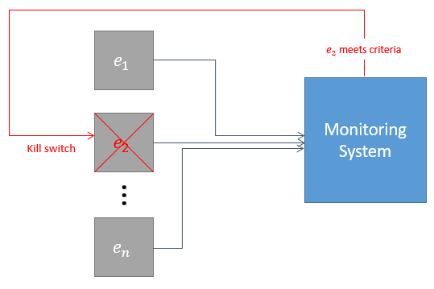
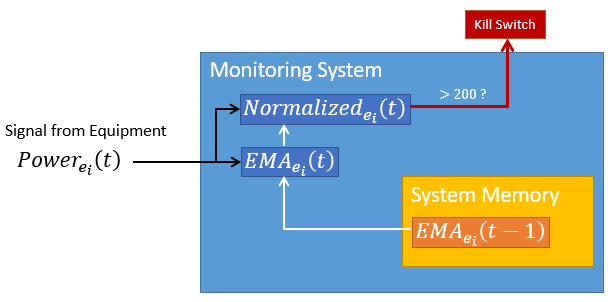

```{r, include = FALSE}
knitr::opts_chunk$set(
  collapse = TRUE,
  comment = "#>"
)

library(dplyr)
library(tidyr)
library(ggplot2)
library(lubridate)
library(meandr)
library(glue)

theme_set(theme_minimal())
```

## Using meandr to optimize failure detection system

This case study draws inspiration from a real-world manufacturing problem. I've included extensive background material, but feel free to [jump ahead](#meandr) to where meandr is actually used.

### Introduction

Suppose we are monitoring a fleet of equipment, $E$, containing $n$ independently operational units.

$$e_i \in E$$
$$i \in [1, n]$$

Each unit $e_i$ operates continuously to fulfill production needs. This does not mean all units are required to operate simultaneously - the size of fleet $E$ allows for individual units to be taken out of service for routine maintenance.

Despite a well-regimented maintenance plan, catastrophic failures often occur with individual units. Figure below illustrates typical equipment failure.

```{r echo = FALSE, fig.width=7, fig.height=3}
meandr:::p1 %>% 
  filter(t > as_datetime("2020-03-01 11:00:00")) %>% 
  mplot() +
  scale_y_continuous(limits = c(2400, 3550)) +
  annotate("text",
           x = as_datetime("2020-03-01 11:05:00"),
           y = 2500,
           size = 4,
           hjust = 0,
           color = "#175C4A",
           fontface = 2,
           label = "Normal Behavior") +
  geom_segment(x = as_datetime("2020-03-01 11:57:00"),
               y = 2650,
               xend = as_datetime("2020-03-01 11:57:00"), 
               yend = 0,
               color = "orangered") +
  annotate("text",
           x = as_datetime("2020-03-01 11:57:00"),
           y = 2650,
           size = 4,
           hjust = 1,
           vjust = 0,
           color = "orangered",
           fontface = 2,
           label = "Power Spike Begins") +
  geom_segment(x = as_datetime("2020-03-01 12:00:00"),
               y = 3500,
               xend = as_datetime("2020-03-01 12:00:00"), 
               yend = 0,
               color = "red") +
  annotate("text",
           x = as_datetime("2020-03-01 11:59:30"),
           y = 3475,
           size = 4,
           hjust = 1,
           vjust = 0,
           color = "red",
           fontface = 2,
           label = "Catastrophic Failure") +
  labs(title = "Unit Power Signal [Watts]", subtitle = "Failure Example") +
  theme(plot.title.position = "plot")
```

The operation typically regards these failures as inevitabilities inherent to the fleet. However, this strategy has become unsustainable with the increasing burden on resource allocation. A more proactive approach is needed to effectively reduce the number of failures.

A closer look shows the power spike is prolonged over the course of 3 minutes. This is good news, since domain experts believe that catastrophic failures can be prevented if unit is shut down early in this window.

```{r echo = FALSE, warning = FALSE, fig.width=7, fig.height=3}
bind_rows(
  mutate(meandr:::p0, i = "p0"),
  mutate(meandr:::p1, i = "p1")
) %>% 
  pivot_wider(names_from = i, values_from = f) %>% 
  filter(t > as_datetime("2020-03-01 11:55:00")) %>% 
  mutate(
    f = case_when(
      t < as_datetime("2020-03-01 11:58:10") ~ p1,
      TRUE ~ NA_real_
    ),
    p1 = if_else(t > as_datetime("2020-03-01 11:58:10"), p1, NA_real_)) %>% 
  ggplot(aes(t, f)) +
  geom_line(size = 2, color = "#175C4A") +
  geom_line(aes(t, p1), size = 1, color = "grey", linetype = 2) +
  labs(x = "", y = "") +
  scale_x_datetime(breaks = scales::date_breaks("30 sec"), date_labels = "%M:%S") +
  geom_segment(x = as_datetime("2020-03-01 11:57:05"),
               y = 2650,
               xend = as_datetime("2020-03-01 11:57:05"), 
               yend = 0,
               color = "orangered") +
  annotate("text",
           x = as_datetime("2020-03-01 11:57:05"),
           y = 2650,
           size = 4,
           hjust = 1,
           vjust = 0,
           color = "orangered",
           fontface = 2,
           label = "Power Spike Begins") +
  geom_segment(x = as_datetime("2020-03-01 11:58:10"),
               y = 3000,
               xend = as_datetime("2020-03-01 11:58:10"), 
               yend = 0,
               color = "seagreen",
               size = 1) +
  annotate("text",
           x = as_datetime("2020-03-01 11:58:10"),
           y = 3000,
           size = 4,
           hjust = 1,
           vjust = 0,
           color = "seagreen",
           fontface = 2,
           label = "Unit Shutdown - Failure Prevented") +
  geom_segment(x = as_datetime("2020-03-01 12:00:00"),
               y = 3500,
               xend = as_datetime("2020-03-01 12:00:00"), 
               yend = 0,
               color = "red") +
  annotate("text",
           x = as_datetime("2020-03-01 12:00:00"),
           y = 3500,
           size = 4,
           hjust = 1,
           vjust = 0,
           color = "red",
           fontface = 2,
           label = "Catastrophic Failure") +
  theme(plot.title.position = "plot",
        panel.grid.minor = element_blank(),
        panel.grid.major.x = element_line())
```

### Monitoring System

Data from each unit $e_i$ is collected in real-time. If unit power meets a certain criteria, we can send a "kill-switch" interlock which will save the unit.

<div class = "figure"></div>

The monitoring system operates with the following constraints:

1. Only the 2 most recent data points are available in-memory.
In other words, the system cannot access values earlier than $t - 1$.
2. A transformation can be stored in a parallel "bin", subject to constraint 1.

#### Simple Solution

Revisiting the initial example, one might propose this criteria:

* If any points detected above 2600W, activate kill-switch.

```{r echo = FALSE, warning = FALSE, fig.width=7, fig.height=3}
bind_rows(
  mutate(meandr:::p0, i = "p0"),
  mutate(meandr:::p1, i = "p1")
) %>% 
  pivot_wider(names_from = i, values_from = f) %>% 
  filter(t > as_datetime("2020-03-01 11:55:00")) %>% 
  mutate(
    f = case_when(
      p1 < 2600 ~ p1,
      TRUE ~ NA_real_
    ),
    p1 = if_else(p1 > 2600, p1, NA_real_)) %>% 
  ggplot(aes(t, f)) +
  geom_point(size = 2, color = "#175C4A") +
  geom_point(aes(t, p1), size = 1, color = "grey") +
  geom_hline(yintercept = 2600, color = "red") +
  labs(x = "", y = "") +
  scale_x_datetime(breaks = scales::date_breaks("30 sec"), date_labels = "%M:%S") +
  geom_segment(x = as_datetime("2020-03-01 11:57:30"),
               y = 3000,
               xend = as_datetime("2020-03-01 11:57:30"), 
               yend = 0,
               color = "seagreen",
               size = 1) +
  annotate("text",
           x = as_datetime("2020-03-01 11:57:30"),
           y = 3000,
           size = 4,
           hjust = 1,
           vjust = 0,
           color = "seagreen",
           fontface = 2,
           label = "Kill-switch activated") +
  theme(plot.title.position = "plot",
        panel.grid.minor = element_blank(),
        panel.grid.major.x = element_line())
```

But this actually won't work: there are many units that normally operate above 2600W, as shown below.

```{r echo = FALSE, fig.width=7, fig.height=3}
meandr:::E %>% 
  filter(i == 7) %>% 
  select(t, f) %>% 
  mplot() +
  geom_hline(yintercept = 2600, color = "red") +
  scale_y_continuous(limits = c(2400, 3200)) +
  annotate("text",
           x = as_datetime("2020-03-01 00:05:00"),
           y = 2610,
           size = 4,
           hjust = 0,
           vjust = 0,
           color = "red",
           fontface = 2,
           label = "Proposed Upper Threshold") +
  annotate("text",
           x = as_datetime("2020-03-01 03:00:00"),
           y = 2800,
           size = 4,
           hjust = 0,
           vjust = 0,
           color = "black",
           fontface = 2,
           label = "Criteria would apply\nunnecessary kill switch",
           lineheight = 0.75) +
  geom_curve(x = as_datetime("2020-03-01 02:50:00"), y = 2820, xend = as_datetime("2020-03-01 00:10:00"), yend = 2900, angle = 60, curvature = -0.4, arrow = arrow(length = unit(0.05, "npc"))) +
  theme(plot.title.position = "plot") +
  labs(title = "Example of stable power above 2600")
```

This means we need to get creative.

Ultimately, we are trying to detect unit power that suddenly deviates from its moving average. But due to constraint 1, we cannot utilize a simple moving average.

#### Exponential Moving Average (EMA)

EMA is uniquely suited for this problem because it does not require past values beyond the 2nd order ($t - 1$). We can create a parallel bin for $EMA_{e_i}$. 

$$EMA_{e_i}(t) = \alpha * Power_{e_i}(t) + (1 - \alpha) * EMA_{e_i}(t - 1)$$

EMA performance for 2 values of $\alpha$ is shown below. For this example, $\alpha < 0.01$ is sufficient.

```{r echo = FALSE, fig.width=7, fig.height=3}
ema <- function(x, alpha = 0.5) {
  out <- double(length(x))
  
  out[1] <- x[1]
  
  for (i in 2:length(x)) {
    out[i] <- alpha * x[i] + (1 - alpha) * out[i - 1]
  }
  
  out
}

meandr:::p1 %>% 
  mutate(ema_0.01 = ema(f, 0.01),
         ema_0.05 = ema(f, 0.05)) %>% 
  pivot_longer(f:last_col()) %>% 
  filter(t > as_datetime("2020-03-01 11:55:00")) %>% 
  ggplot(aes(t, value, color = name)) +
  geom_point() +
  geom_line(aes(group = name)) +
  scale_color_manual(values = c("#EE5F57", "#892CDC", "#175C4A"), labels = c("alpha = 0.01", "alpha = 0.05", "original signal"), name = NULL) +
  theme_minimal() +
  labs(title = "EMA") +
  theme(plot.title.position = "plot",
        panel.grid.minor = element_blank(),
        panel.grid.major.x = element_line())
```

We define an additional parallel bin producing a *normalized power signal*.

$$Normalized_{e_i}(t) = Power_{e_i}(t) - EMA_{e_i}(t)$$
Finally, we can define a new criteria that prevents this failure without inadvertently killing the fleet.

* If unit power deviates from EMA by greater than 200W, activate kill-switch.

```{r echo = FALSE, warning = FALSE, fig.width=7, fig.height=3}
df <- meandr:::p1 %>% 
  mutate(ema_0.01 = ema(f, 0.01),
         f = f - ema_0.01,
         i = cumsum(f > 200) > 0) %>% 
  filter(t > as_datetime("2020-03-01 11:55:00"))

ggplot(df, aes(t, f)) +
  geom_point(size = 2, color = "#175C4A", data = filter(df, !i)) +
  geom_point(size = 1, color = "grey", data = filter(df, i)) +
  geom_hline(yintercept = 200, color = "red") +
  scale_y_continuous(breaks = scales::breaks_width(200)) +
  labs(title = "Normalized Power", x = "", y = "") +
  scale_x_datetime(breaks = scales::date_breaks("30 sec"), date_labels = "%M:%S") +
  geom_segment(x = min(filter(df, i)$t),
               y = 400,
               xend =  min(filter(df, i)$t),
               yend = 0,
               color = "seagreen",
               size = 1) +
  annotate("text",
           x = min(filter(df, i)$t),
           y = 400,
           size = 4,
           hjust = 1,
           vjust = 0,
           color = "seagreen",
           fontface = 2,
           label = "Kill-switch activated") +
  theme(plot.title.position = "plot",
        panel.grid.minor = element_blank(),
        panel.grid.major.x = element_line())
```

The graphic below illustrates the criteria logic.

<div class = "figure"></div>

We only want to apply a kill-switch interlock when absolutely necessary. There are multiple reasons why interlocking too much is undesirable:

* An interlock response protocol is in place for a team to execute. Excessive interlocks will draw this team's attention and resources away from other important issues.
* Excessive interlocks could drain replacement unit inventory, creating a potential supply chain crisis in the future.
* Eventually, the team will begin to treat the interlock less seriously as they realize its poorly configured. Further improvements to the interlock will be undermined by its eroded reputation.

**Bottom line**: the interlock must be carefully optimized so that it's only triggered by legitimate failure spike.

Most of the historical data at our disposal is well-behaved. Testing on this data will not provide sufficient confidence that our criteria will achieve a satisfactory signal-to-noise ratio. We want to recreate the worst case scenario: power signal that behaves erratically, but is not a failure spike.

### <a name = "meandr"></a>meandr application

Domain experts have provided us with some basic parameters concerning power behavior:

* Most units operate between range of 2000W - 3000W.
* Gradual fluctuations of +/- 100W per day are normal.
* In rare cases, unit will experience sudden power shift of ~150W. These shifts are innocuous.
* Typical hardware noise of +/- 1W due to power measurement resolution
* Power signal sampling period is 5 seconds.

Let's use meandr to bring these specifications to life! We'll create sample power signals for 24 hour increments. 

```{r}
library(dplyr)
library(tidyr)
library(ggplot2)
library(lubridate)
library(meandr)

# we will simulate 100 signals
n <- 100

# create time vector
t0 <- as_datetime("2020-05-02 00:00:00")
t_vec <- seq(t0,
             t0 + dhours(24), # simulating 24 hours
             by = dseconds(5)) # 5 sec sampling period

# Since we are simulating worst-case scenario, every sample will contain 100W shift
shift <- 150

# Create simulated data
set.seed(2)

data <- tibble(
  i = 1:n,
  unit_avg = runif(n, 2000, 3000), # Most units operate between range of 2000W - 3000W.
  shift_point = sample(t_vec, size = n, replace = TRUE)
) %>% 
  rowwise() %>% 
  mutate(data = list(
           meandr::meandr(n_points = length(t_vec), # match t_vec
                          seed = i) %>% 
             mutate(t = t_vec, # override default meandr t vector
                    f = unit_avg + f * 100, # Gradual fluctuations of +/- 100W per day.
                    f = f + rnorm(length(t), sd = 1)) # Hardware noise
         )
  ) %>% 
  unnest(cols = data) %>% 
  mutate(f = if_else(t > shift_point, f + shift, f)) # apply shift
```

Here is an example of a few curves. Looks good so far!

```{r echo = FALSE, warning = FALSE, fig.width=7, fig.height=3}
data %>% 
  filter(i %in% 1:3) %>% 
  ggplot(aes(t, f)) +
  geom_line(aes(group = i)) +
  theme(panel.grid.minor = element_blank()) +
  scale_x_datetime(breaks = scales::date_breaks("4 hour"), date_labels = "%H:%M") +
  labs(title = "Simulated Power Signals", x = "", y = "")
```


Next, we need to simulate our monitoring system conditions by applying EMA, defined below.
```{r}
ema <- function(x, alpha = 0.5) {
  out <- double(length(x))
  
  out[1] <- x[1]
  
  for (i in 2:length(x)) {
    out[i] <- alpha * x[i] + (1 - alpha) * out[i - 1]
  }
  
  out
}
```

As demonstrated earlier, if $\alpha$ is to high, EMA will track original power signal too closely.    

For instance, $\alpha = 0.001$ appears to be suitable for the below curve. But given our simulation characteristics, is there a curve where EMA falls sufficiently behind an upward trend that an upward spike pushes the normalized value over 200? 

```{r echo = FALSE, warning = FALSE, fig.width=7, fig.height=3}
data %>% 
  filter(i == 1) %>% 
  mutate(ema = ema(f, alpha = 0.001)) %>% 
  pivot_longer(ema:f) %>% 
  ggplot(aes(t, value)) +
  geom_line(aes(color = name, group = name)) +
  scale_color_manual(values = c("#892CDC", "#175C4A"), labels = c("alpha = 0.001", "original signal"), name = NULL) +
  scale_x_datetime(breaks = scales::date_breaks("4 hour"), date_labels = "%H:%M") +
  labs(x = "", y = "")
```


```{r}
library(purrr)

max_normalized <- tibble(alpha = seq(0.001, 0.01, by = 0.001)) %>% 
  mutate(max_normalized = map_dbl(alpha, .f = ~ {
  data %>% 
    group_by(i) %>% 
    mutate(normalized = f - ema(f, alpha = .x)) %>% 
    ungroup() %>% 
    arrange(desc(normalized)) %>% 
    pull(normalized) %>% 
    .[[1]]
}))
```

As it turns out, there is a hypothetical curve where $\alpha = 0.001$ would be too low.
```{r echo = FALSE, warning = FALSE, fig.width=7, fig.height=3}
max_normalized %>% 
  ggplot(aes(alpha, max_normalized)) +
  geom_point() +
  geom_line() +
  geom_hline(yintercept = 200, color = "red") +
  scale_x_continuous(breaks = scales::breaks_width(0.001)) +
  labs(title = "Max Normalized", y = "") +
  theme(panel.grid.minor = element_blank())
```

```{r echo = FALSE, warning = FALSE, fig.width=7, fig.height=3}
data %>% 
  filter(i == 65) %>% 
  mutate(ema = ema(f, alpha = 0.001)) %>% 
  pivot_longer(ema:f) %>% 
  ggplot(aes(t, value)) +
  geom_line(aes(color = name, group = name)) +
  scale_color_manual(values = c("#892CDC", "#175C4A"), labels = c("alpha = 0.001", "original signal"), name = NULL) +
  scale_x_datetime(breaks = scales::date_breaks("4 hour"), date_labels = "%H:%M") +
  labs(title = "Example where alpha = 0.001 is too low")
```

### Conclusion

Using meandr in conjunction with the tidyverse, we are able to estimate a lower boundary for our EMA tuning parameter, $\alpha$. Though this will need to be verified with real data, we save some time by forgoing a purely arbitrary selection of $\alpha$.
